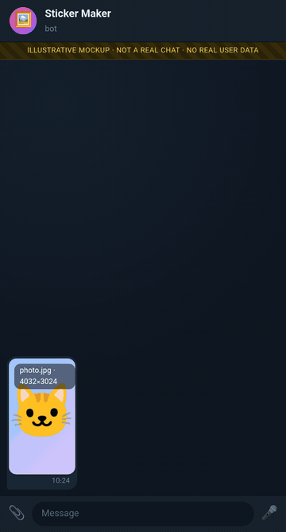
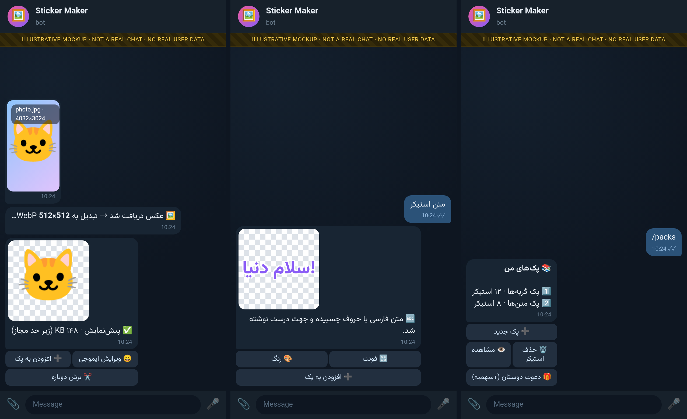

<!-- readme-top -->
<div align="center">


# Telegram Sticker Maker Bot — Photos & Text to Stickers (Persian/English)

[](LICENSE)   [](https://github.com/reza-em/telegram-sticker-maker-bot/stargazers)

> Telegram bot that turns photos and text into stickers: automatic resize/compress to Telegram sticker limits, Persian text rendering, sticker pack management, emoji editing. Python + Pillow.

**[فارسی](#-فارسی) · [English](#-english) · [Русский](#-русский) · [Deutsch](#-deutsch)**

⭐ **If this project is useful to you, please give it a star** — it helps other people find it. [**Star on GitHub**](https://github.com/reza-em/telegram-sticker-maker-bot/stargazers) · 🍴 [Fork](https://github.com/reza-em/telegram-sticker-maker-bot/fork) · 🐛 [Issues](https://github.com/reza-em/telegram-sticker-maker-bot/issues)

</div>

## ✨ Highlights

- 🖼 **Photo → sticker**: automatic resize and compression to Telegram's size and weight limits (WebP)
- 🔤 **Text → sticker** with correct Persian/Arabic letter shaping and direction (arabic-reshaper + python-bidi)
- 📚 **Sticker pack management**, emoji editing and a preview before adding
- 🎁 Per-user quotas, invite rewards, admin panel with support contact
- 🧪 Offline tests with a mocked Telegram API

## 🎬 Demo

<div align="center">

</div>

<div align="center">

</div>

> 🖼 **These are illustrative mockups**, rendered locally from scripted conversations (see [`docs/mockups`](docs/mockups)). They are not real chats and contain no real user data; names, numbers and links are examples.

## 🚀 Quick start

```bash
git clone https://github.com/reza-em/telegram-sticker-maker-bot.git && cd telegram-sticker-maker-bot
pip install -r requirements.txt
export TELEGRAM_BOT_TOKEN=...          # from @BotFather
export OWNER_USERNAME=your_telegram_username
./run.sh
python3 test_offline.py
```

More options, admin panel and platform notes are in the sections below. Tokens are read only from environment variables — never commit them.

---

## 🌐 فارسی

ربات تلگرام **استیکرساز**: عکس یا متن بفرستید و استیکر بگیرید. تبدیل خودکار به اندازه و حجم استیکر تلگرام، متن فارسی با شکل‌دهی درست حروف، مدیریت پک استیکر، ویرایش ایموجی و پیش‌نمایش پیش از افزودن.

**کلیدواژه‌ها:** استیکرساز تلگرام، ساخت استیکر، ربات استیکر، استیکر فارسی، پک استیکر، ربات تلگرام پایتون

## 🇬🇧 English

A **Telegram sticker maker bot**: send a photo or text and get a sticker. Automatic resizing and compression to Telegram sticker limits (WebP), correct Persian/Arabic text shaping, sticker pack management, emoji editing, preview before adding, invite/quotas and admin tools. Python + Pillow.

**Keywords:** Telegram sticker maker, create stickers from photos, sticker pack bot, text to sticker, WebP sticker converter, Persian text stickers

## 🇷🇺 Русский

**Telegram-бот для создания стикеров**: отправьте фото или текст — получите стикер. Автоматическое изменение размера и сжатие под требования Telegram (WebP), корректный персидский текст, управление стикерпаками, редактирование эмодзи. Python + Pillow.

**Ключевые слова:** создать стикеры Telegram, бот стикеров, стикерпак, фото в стикер, WebP

## 🇩🇪 Deutsch

**Telegram-Sticker-Maker-Bot**: Foto oder Text senden, Sticker erhalten. Automatische Größenanpassung und Kompression auf Telegram-Sticker-Limits (WebP), korrekte persische Textdarstellung, Sticker-Pack-Verwaltung, Emoji-Bearbeitung. Python + Pillow.

**Stichwörter:** Telegram Sticker erstellen, Sticker Bot, Sticker-Pack, Foto zu Sticker, WebP

---

## Features

- Photo to sticker with automatic compression to size limits
- Text stickers with Persian/Arabic shaping (arabic-reshaper + python-bidi)
- Pack management, emoji editing, preview mode
- Per-user quotas, invite rewards, admin panel with support contact
- Offline tests with mocked Telegram API

## Setup

```bash
pip install -r requirements.txt
export TELEGRAM_BOT_TOKEN=...          # from @BotFather
export OWNER_USERNAME=your_telegram_username
./run.sh
python3 test_offline.py
```

> **Configuration note:** the owner/admin identity is read from environment variables (`OWNER_ID`, `OWNER_USERNAME`, `SUPPORT_USERNAME`) with the placeholder `example_owner`. Set them to your own values before running. Never commit bot tokens — they are read only from the environment.

## Usage

Open your bot in the messenger and send `/start`. See the detailed documentation below for commands, admin panel and platform-specific notes.

## License

Code released under the [MIT License](LICENSE).

---

## Detailed documentation

_See source code and inline comments._
